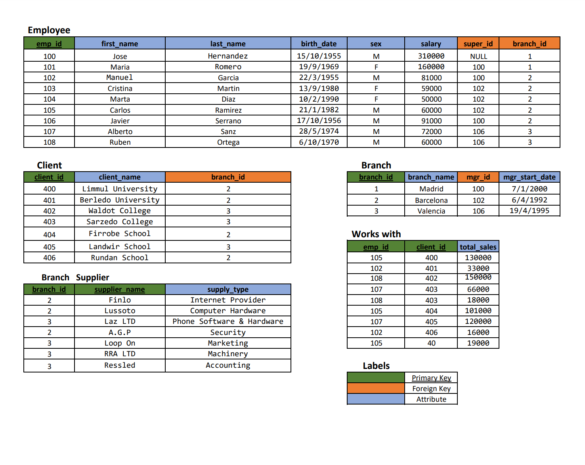

# Example of queries using different strategies and topics



this database was based on [SQL-Complex-Database-Schema ](https://github.com/IvanHanonoCozzetti/SQL-Complex-Database-Schema/blob/main/company_database.sql)

some minors tweaks were because of errors in the schema


1. **This query retrieves employee information along with their branch name for employees working in the Barcelona branch.**
`know your people right?`

```sql

SELECT e.emp_id, e.first_name, e.last_name, e.salary, b.branch_name
FROM employee e
JOIN branch b ON e.branch_id = b.branch_id
WHERE b.branch_name = 'Barcelona';

```   

2. **Query to Calculate Total Sales by Employee:**
`A very important query`

````sql

SELECT emp_id, SUM(total_sales) AS total_sales
FROM works_with
GROUP BY emp_id;

````

3. **Query to Find Employees with No Assigned Supervisor :**
`luckily no case of this`
 
````sql

SELECT emp_id, first_name, last_name
FROM employee
WHERE super_id IS NULL;

````

4. **Query to Update Employee Salary on banch id 3:**
`hard workers I'm sure`

````sql

UPDATE employee
SET salary = salary * 1.1
WHERE branch_id = 3;

````

5. **Query to Identify Branch Managers and Their Start Dates**
`know your people with date stats`

````sql

SELECT e.first_name, e.last_name, b.branch_name, b.mgr_start_date
FROM employee e
JOIN branch b ON e.emp_id = b.mgr_id;
````

6. **Query to Find Clients with High Total Sales**
`the mvps, get the good coffe for them`

````sql

SELECT c.client_name, SUM(ww.total_sales) AS total_sales
FROM client c
JOIN works_with ww ON c.client_id = ww.client_id
GROUP BY c.client_name
HAVING SUM(ww.total_sales) > 100000;
````

7. **Query to Determine Employee Gender Distribution:**
`Progressist query use with care`
````sql

SELECT sex, COUNT(*) AS count
FROM employee
GROUP BY sex;
````

8. **Query to Remove Inactive Branch Managers:**
`there is no such thing as inactive in the organization (3 affected)`
````sql

DELETE FROM branch
WHERE mgr_start_date < DATE_SUB(NOW(), INTERVAL 1 YEAR);

````

9. **Query to Identify Branches with Multiple Suppliers:**
`another organization stat`
````sql

SELECT branch_id, COUNT(DISTINCT supplier_name) AS supplier_count
FROM branch_supplier
GROUP BY branch_id
HAVING COUNT(DISTINCT supplier_name) > 1;

````

10. **Query to Calculate Average Employee Salary per Branch:**
`and to think people still does this by hand`

````sql

SELECT b.branch_name, AVG(e.salary) AS avg_salary
FROM employee e
JOIN branch b ON e.branch_id = b.branch_id
GROUP BY b.branch_name;

````
